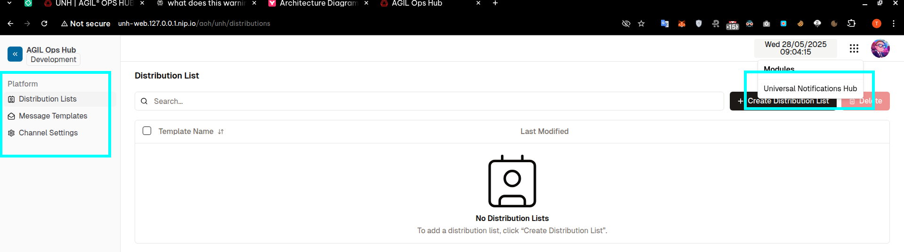

1. change AuthService.validateToken to use offline token validation only, because the web already validate itself https://mssfoobar.github.io/docs/2.0.0/modules/iams/development/authentication/id-token-access-token-refresh-tokens#offline-validation , we should use offline validation for mobile
1. rate limiting using WAF
1. rtus: must be only 1 replica with vertical scale
1. TLS
1. db encryption
1. count db connections for all services and all pods if they scale out to max
1. incorrect sidebar and module setup 

1. ? ar-bff to:
  - centralized auth
  - rate limit apis
  - abstract away the comple backend apis


ask aoh:
1. rtus-seh: 


ian -> rtus user map


bft -> incident 

gis -> rtus-seh


- device:
  - login: 
    - FE: call POST tracked_entity:
      - BE: check if device_id exist
        - if existed: call upsert geo entity location, and updated at
        - if not existed: create a tracked_entity
          - then call upsert entity
            - behind the scene:
              - gis: 
                - create or update by entity_id
                - call rtus-pms POST json-maps to insert json_map_data

    -

- be:
  - on AR init: run POST {{baseUrl}}/admin/tenants/:tenantId/json-maps/:mapName/sse to create the gis json-map because the gis modlet stream sse from it
  - create a 


#####################################
4
User story: As a user, I want to log in securely.

Acceptance criteria:
1. Use OpenID with PKCE flow.
2. The login screen must show Agil Response.
3. Session should last for 1 hour.
4. Roles: commander and responder.

Implementation
- ar-web: create a POST /api/v1/login, redirect to Keycloak.
- Client must not pass credentials to ar-web but pass to Keycloak login screen only.
- Update Keycloak configurations:
  - Disable client auth.
  - SSO Session Idle: 30 mins.
  - SSO Session Max: 60 mins.
  - Create 2 realm roles: commander and responder


#####################################


User story: As a commander, I want to track personnel and assets in real-time.

Acceptance criteria:
1. For commander:
  1.1 Web:
    1.1.1. There is a map that shows the tracked entities.
    1.1.2. Entity types: aircraft, personnel, incident.
2 For the tracked entity:
  2.1 Mobile:
    2.1.1 After logging in, the commander can see this device's status is active and location is correct.
    2.1.2. The location and status is updated every 2 minutes.


Implementation
1.1.1. Integrate AOH's modules: gis, rtus
2.1.1 & 2.1.2.
- When not logged in: track device only
- When logged in: track user
- Devices: mobile, browser
- How to track: 
  - The tracked device call 'POST /location' every 2 minutes.
    - Payload: 
      ```json
      {
        "id": "12345abc", // device id or user id
        "longitude": 125.85984,
        "latitude": 1.24843,
        "altitude": 125.85984,
      }
      ```
  - BFT server: POST /location
    - call GIS service to upsert geo entity: PUT /geoentity (behind the scene after inserting the geo entity, gis will call rtus-pms to create or update the json_map -> publish event to rtus-seh -> emit sse event to the devices)
      Body:
        ```json
          {
            "geojson": {
              "type": "Feature",
              "geometry": {
                "type": "Point",
                "coordinates": [
                  125.85984,
                  1.24843
                ]
              },
              "properties": {
                "kind": "aircraft",
                "active": "true",
                "heading": 0,
                "callsign": "string",
                "updated_at": 1750133451717 // now
              }
            },
            "entity_id": "356938035643809",
            "entity_type": "aircraft"
          }
        ```
    - Create a k8s cron job that run every 30 minutes:
      - call BFT PUT /status,
        - call GIS GET /geoentities
        - loop pages and get geo entities, check if entity.geojson.properties.updated_at > 5 minutes, update it to `active: false`
          - GIS call rtus-pms -> rtus-seh to publish sse event to the devices

  - BFT web browser:
    - subscribe to the map event: GET {{rtusSehBaseUrl}}/tenants/:tenantId/json-maps/:mapName
      - mapName: gis
    - on message: update the position of the entity on the map based on entity_id
      - payload
        ```json
          {
            "id": "6273ff31-32b2-4af5-9b87-76c9745ade87",
            "geojson": {
              "geometry": {
                "type": "Point",
                "coordinates": [
                  125.85984,
                  1.24843
                ]
              },
              "type": "Feature",
              "properties": {
                "kind": "aircraft",
                "active": "true",
                "heading": 0,
                "callsign": "string",
                "updated_at": 1750133451717
              }
            },
            "created_at": 1750133451717,
            "updated_at": null,
            "created_by": "f67cb8f5-0645-444d-a4bd-c61aaf1b2db0",
            "updated_by": "f67cb8f5-0645-444d-a4bd-c61aaf1b2db0",
            "tenant_id": "bf15a66a-d4ff-4cc7-87c7-3926b208ebb7",
            "occ_lock": 3,
            "entity_id": "356938035643809",
            "entity_type": "aircraft"
          }
        ```
  
#####################################

  
  
  
  
  
  
  
  
  
  
  
  
  
  
  
  
  
  
  
  
  
  
  <!-- - Create a database to store the tracked entities:
    - Table name: tracked_entity
    - Columns:
      - id: uuid, pk
      - device_id: string, not nullable
      - type: enum: aircraft, personnel, incident
      - name: string, nullable
      - description: string, nullable
      - created_at: timestamptz, auto
      - updated_at: timestamptz, nullable
      - deleted_at: timestamptz, nullable
   -->


#####################################

User story: As a commander, I want to track incidents which are automatically detected by cameras.

Acceptance criteria:
1. Incidents are automatically detected by cameras: 
  1.1. TBD: wait for integration with Hikvision
  1.2. API for creating an incident.
    1.2.1. The commander must receive an in-app notification.
    1.2.2. The commander must receive a push notification.

2. For commander:
  2.1. Web:
    2.1.1. There is a map that shows the incidents and their locations.
    2.1.2. The resolved incidents should not be showed on the map.
    2.1.3. Clicking on each should show its info
    2.1.4. Incident list:
      - Default order: 
        - Severity: Critical > High > low.
        - Status: New > In Progress > Resolve .
        - Created Date: Latest > oldest.
      - There are drop-downs to filter by: Severity, Status, or Date range. 
    2.1.5. Clicking on the notification in the drop-down will open the incident details page.


Implementation
1.2.1. Integrate with ims and ian modules.
- CRUD incident APIs: https://mssfoobar.github.io/docs/2.2.0/modules/ims/development/api

- After creating an incident successfully, find users having `commander` roles to send in-app notification:

  - GET {{iams-aas}}/admin/tenants/{tenantId}/roles/{role-name}/users
    - role-name: commander

  - POST {{IAN_ENDPOINT}}/v1/messages

      Body:

        ```json
        {
          "title": "09/25/27 11:27 VST",
          "body": "This is a term notification",
          "sender_id": "87c32f76",
          "receiver_ids": [
            "ca7f1f8a-4bac-4639-9140-14f9bc8e9daa",
            "c8d82c66-9fc1-4ae7-8b09-ff07fed9f7e2"
          ],
          "tenant_id": "bf15a66a-d4ff-4cc7-87c7-3926b208ebb7",
          "icon_id": "9eb7b82c-8256-45e4-9de7-560018e00877"
        }
        ```

1.2.2. Integrate with unh and ptmg modules.
- Setup FMC.
- Create distribution list: `"internal_role_id": ["commander"]`.
- Create notification template.
  ```json
  {
      "distribution_list_id": "d00c61bf-8722-4ef7-9a28-f60925e8ca58",
      "push_notification": {
          "channel_id": "193b38d0-2fd2-40cc-93ae-96c1e7fd4c7d",
          "title": "Incident - {{incident_id}}",
          "body": "Incident type {{incident_type}} occurred. Please stay alert.",
          "image_url": "http://www.example.com/img/logo.png"
      }
  }
  ```
- Send push noti: `POST /v1/notification/send/template/{template_id}`

2.1.1. Update UI to render new geo entity type: incident, status: "New" "In Progress", "Resolved", "Closed"


iams:
- create a user:
  - use iams-aas web: http://iams-web.127.0.0.1.nip.io/
    - create use
    - add user to the tenant
    - if the user is assigned more than 1 tenant, they are required to select an active tenant before getting token


# Agil Response 

## Concepts
Roles: 
- System admin (already exists):
  - CRUD users and roles.
- Moderator:
  - Can assign/unassign commander role.
  - Can CRUD teams, incidents, tasks.
- Commander:
  - Can CRUD own teams.
  - Can add/remove team members.
  - Can CRUD tasks.
  - Assign tasks to own team members.
  - Can CRUD own incidents or members' created incident.
  - Can CRUD own comments or members' created comments.
- Responder:
  - Can update and view the assigned tasks.
  - Can view and comment on tasks and incidents assigned to their teams.

Incident:
- An unpleasant event.

Boundary:
- Is a working area of a team.
- Belongs to only 1 team.
- Is visible to its team members.
- Cannot cross the boundary of other teams.

Team
- Max member: 5 with only 1 commander.
- A commander can be a member of another team.

## Flows
### Team
#### Create a team
- Create team form:
  - Team name (required).
  - Team description (required).
  - Select members (required).
  - Set boundary (required).
- After submission, notify team members.
- Users can only see each other if they are in the same teams.

#### Update a team
- Update team form:
  - Team name (optional).
  - Team description (optional).
  - Add or remove members (optional).
  - Update boundary (optional).
- After submission, notify team members about the changes.

#### Delete a team
- Cannot delete if there are unresolved tasks.
- After deletion:
  - Release the boundary.
  - Archive all relating tasks and incidents to.
- Cannot undo the deletion.

### Incident
#### Create an incident
- Entities that can create incidents:
  - Responders.
  - AI integrated drones.

- Create incident form:
  - Title (required).
  - Description (required).
  - Category (required).
  - Severity (required).
  - Location (required): 
    - Auto-fill in the current location with longitude, latitude, and altitude. 
    - Editable.
  - Reported by (required): 
    - Auto-fill in the current user.
    - Editable.
  - Attachments (optional): Max 20 items, max size each: 10 MB.
  - An option to create a corresponding task (???).
- After submission
  - Create push and in-app notifications to the commander of the location and to the moderator.

#### Update an incident
- Updatable fields: 
  - Status.
  - Title.
  - Description.
  - Category.
  - Severity.
  - Location.
  - Reported by.
  - Attachments: Add or remove attachments.
- Resolved incidents are removed from the map.

#### View incident list
- Default order: 
  - Severity: Critical > High > low.
  - Status: New > In Progress > Resolve .
  - Created Date: Latest > oldest.
- There are drop-downs to filter by: Severity, Status, or Date range. 
- Clicking on the notification in the drop-down will zoom in the map and open the incident detail.


#### Delete an incident
- The deleted incidents will be removed from the map.
