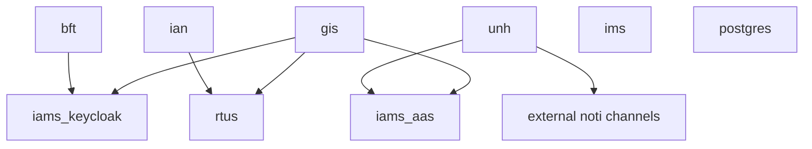

```mermaid
graph TB

  bft --> iams_keycloak
  unh --> iams_aas
  unh --> external[external noti channels]
  gis --> iams_keycloak
  gis --> iams_aas
  ian --> rtus
  gis --> rtus
  ims
  
  postgres

```

BFT:
- asset:
  - id: uuid
  - type: 

Admin:
- user logs in
- go to bft > gis
- create incident:
  - 

Device:
- login via keycloak
- upsert geo entity: status 'active' every 5 mins

