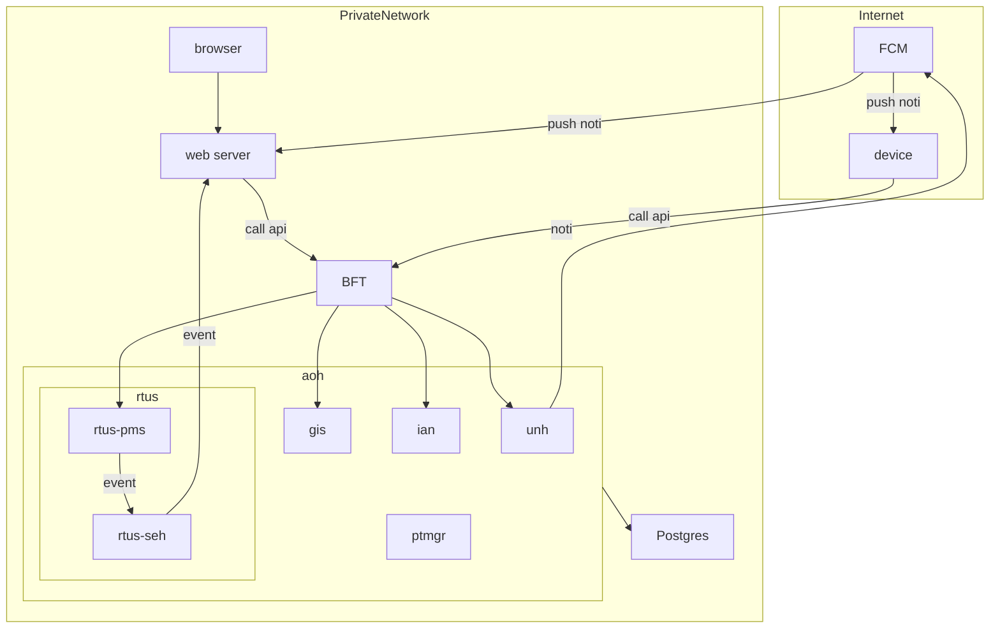

## Overview

```mermaid
flowchart TD
    FCM -- push noti --> web
    FCM -- push noti --> device


    subgraph Internet
      FCM
      device
    end

    subgraph PrivateNetwork
      browser --> web
      web[web server] -- call api --> BFT
      device -- call api --> BFT
      BFT --> rtus-pms
      BFT --> gis
      BFT --> ian
      BFT --> unh

      unh -- noti --> FCM

      rtus-seh -- event --> web
      aoh --> Postgres

      subgraph aoh
        rtus
        gis
        ian
        unh
        ptmgr
      end

      subgraph rtus
        rtus-pms -- event --> rtus-seh
      end
    end

```
