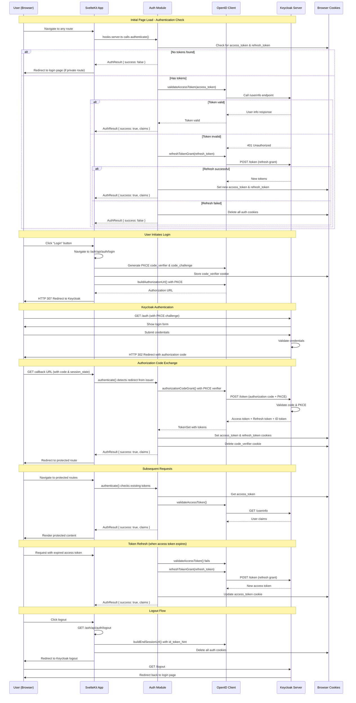

```mermaid
sequenceDiagram
    participant User as User (Browser)
    participant App as SvelteKit App
    participant Auth as Auth Module
    participant OIDC as OpenID Client
    participant KC as Keycloak Server
    participant Cookies as Browser Cookies

    Note over User,KC: Initial Page Load - Authentication Check
    User->>App: Navigate to any route
    App->>Auth: hooks.server.ts calls authenticate()
    Auth->>Cookies: Check for access_token & refresh_token
    
    alt No tokens found
        Auth-->>App: AuthResult { success: false }
        App->>User: Redirect to login page (if private route)
    else Has tokens
        Auth->>OIDC: validateAccessToken(access_token)
        OIDC->>KC: Call /userinfo endpoint
        alt Token valid
            KC-->>OIDC: User info response
            OIDC-->>Auth: Token valid
            Auth-->>App: AuthResult { success: true, claims }
        else Token invalid
            KC-->>OIDC: 401 Unauthorized
            Auth->>OIDC: refreshTokenGrant(refresh_token)
            OIDC->>KC: POST /token (refresh grant)
            alt Refresh successful
                KC-->>OIDC: New tokens
                Auth->>Cookies: Set new access_token & refresh_token
                Auth-->>App: AuthResult { success: true, claims }
            else Refresh failed
                Auth->>Cookies: Delete all auth cookies
                Auth-->>App: AuthResult { success: false }
            end
        end
    end

    Note over User,KC: User Initiates Login
    User->>App: Click "Login" button
    App->>App: Navigate to /aoh/api/auth/login
    App->>OIDC: Generate PKCE code_verifier & code_challenge
    App->>Cookies: Store code_verifier cookie
    App->>OIDC: buildAuthorizationUrl() with PKCE
    OIDC-->>App: Authorization URL
    App->>User: HTTP 307 Redirect to Keycloak

    Note over User,KC: Keycloak Authentication
    User->>KC: GET /auth (with PKCE challenge)
    KC->>User: Show login form
    User->>KC: Submit credentials
    KC->>KC: Validate credentials
    KC->>User: HTTP 302 Redirect with authorization code

    Note over User,KC: Authorization Code Exchange
    User->>App: GET callback URL (with code & session_state)
    App->>Auth: authenticate() detects redirect from issuer
    Auth->>OIDC: authorizationCodeGrant() with PKCE verifier
    OIDC->>KC: POST /token (authorization code + PKCE)
    KC->>KC: Validate code & PKCE
    KC-->>OIDC: Access token + Refresh token + ID token
    OIDC-->>Auth: TokenSet with tokens
    Auth->>Cookies: Set access_token & refresh_token cookies
    Auth->>Cookies: Delete code_verifier cookie
    Auth-->>App: AuthResult { success: true, claims }
    App->>User: Redirect to protected route

    Note over User,KC: Subsequent Requests
    User->>App: Navigate to protected routes
    App->>Auth: authenticate() checks existing tokens
    Auth->>Cookies: Get access_token
    Auth->>OIDC: validateAccessToken()
    OIDC->>KC: GET /userinfo
    KC-->>OIDC: User claims
    Auth-->>App: AuthResult { success: true, claims }
    App->>User: Render protected content

    Note over User,KC: Token Refresh (when access token expires)
    User->>App: Request with expired access token
    Auth->>OIDC: validateAccessToken() fails
    Auth->>OIDC: refreshTokenGrant(refresh_token)
    OIDC->>KC: POST /token (refresh grant)
    KC-->>OIDC: New access token
    Auth->>Cookies: Update access_token cookie
    Auth-->>App: AuthResult { success: true, claims }

    Note over User,KC: Logout Flow
    User->>App: Click logout
    App->>App: GET /aoh/api/auth/logout
    App->>OIDC: buildEndSessionUrl() with id_token_hint
    App->>Cookies: Delete all auth cookies
    App->>User: Redirect to Keycloak logout
    User->>KC: GET /logout
    KC->>User: Redirect back to login page

```
