# Dash System Architecture Diagrams

## 1. System Architecture Overview

```mermaid
graph TB
    %% Define color scheme for positive, readable appearance
    classDef userClass fill:#e1f5fe,stroke:#0277bd,stroke-width:3px,color:#000
    classDef frontendClass fill:#f3e5f5,stroke:#7b1fa2,stroke-width:3px,color:#000
    classDef backendClass fill:#e8f5e8,stroke:#2e7d32,stroke-width:3px,color:#000
    classDef databaseClass fill:#fff3e0,stroke:#ef6c00,stroke-width:3px,color:#000
    classDef authClass fill:#fce4ec,stroke:#c2185b,stroke-width:3px,color:#000
    classDef infraClass fill:#f1f8e9,stroke:#558b2f,stroke-width:3px,color:#000

    %% User Layer
    User[👤 User Browser]:::userClass

    %% Frontend Layer
    subgraph "Frontend Layer"
        SvelteKit[🎨 SvelteKit Web App<br/>- TypeScript + Svelte 5<br/>- TailwindCSS + AOH Design<br/>- Widget Management<br/>- Dashboard Creation]:::frontendClass
        Storybook[📚 Storybook<br/>Component Library]:::frontendClass
    end

    %% Reverse Proxy
    Traefik[🔀 Traefik Reverse Proxy<br/>- Load Balancing<br/>- SSL Termination<br/>- CORS Headers]:::infraClass

    %% Backend Layer
    subgraph "Backend Layer"
        DashAPI[🚀 Dash API Service<br/>Go + Chi Router<br/>- Dashboard CRUD<br/>- Widget Management<br/>- Category Management<br/>- Favourite Management]:::backendClass

        subgraph "External Services"
            TagService[🏷️ Tag Service<br/>Tag Management]:::backendClass
            IAMSService[🔐 IAMS AAS<br/>Authorization Service]:::authClass
        end
    end

    %% Authentication Layer
    subgraph "Authentication Layer"
        Keycloak[🔑 Keycloak<br/>- JWT Token Issuer<br/>- User Authentication<br/>- Multi-tenant Support]:::authClass
    end

    %% Database Layer
    subgraph "Database Layer"
        DashDB[(🗄️ Dashboard Database<br/>PostgreSQL 17.0<br/>Schema: aoh_dash)]:::databaseClass
        KeycloakDB[(🔐 Keycloak Database<br/>PostgreSQL 17.0)]:::databaseClass
    end

    %% Infrastructure
    subgraph "Infrastructure"
        Docker[🐳 Docker Containers]:::infraClass
        GitHub[📦 GitHub Container Registry]:::infraClass
    end

    %% Connections
    User --> Traefik
    Traefik --> SvelteKit
    Traefik --> Keycloak
    Traefik --> IAMSService

    SvelteKit --> DashAPI
    SvelteKit --> Keycloak
    SvelteKit --> TagService

    DashAPI --> DashDB
    DashAPI --> Keycloak
    DashAPI --> TagService

    Keycloak --> KeycloakDB
    IAMSService --> Keycloak

    Docker --> GitHub
```

## 2. Deployment Architecture

```mermaid
graph TB
    %% Define color scheme
    classDef loadBalancer fill:#e3f2fd,stroke:#1976d2,stroke-width:3px,color:#000
    classDef webTier fill:#f3e5f5,stroke:#7b1fa2,stroke-width:3px,color:#000
    classDef appTier fill:#e8f5e8,stroke:#2e7d32,stroke-width:3px,color:#000
    classDef authTier fill:#fce4ec,stroke:#c2185b,stroke-width:3px,color:#000
    classDef dataTier fill:#fff3e0,stroke:#ef6c00,stroke-width:3px,color:#000
    classDef monitoring fill:#f1f8e9,stroke:#558b2f,stroke-width:3px,color:#000

    %% Load Balancer Tier
    subgraph "Load Balancer Tier"
        Traefik[🔀 Traefik v3.1<br/>Port: 80, 8080<br/>- HTTP/HTTPS Routing<br/>- Service Discovery<br/>- Health Checks]:::loadBalancer
    end

    %% Web Tier
    subgraph "Web Tier"
        DashWeb[🎨 Dash Web Container<br/>dash-web:latest-dev<br/>Port: 80<br/>- SvelteKit SSR<br/>- Static Assets<br/>- Client-side Routing]:::webTier
    end

    %% Application Tier
    subgraph "Application Tier"
        DashApp[🚀 Dash App Container<br/>dash:latest-dev<br/>Port: 5000<br/>- Go HTTP Server<br/>- REST API<br/>- Business Logic]:::appTier

        TagApp[🏷️ Tag Service<br/>External Service<br/>- Tag Management<br/>- Cross-reference]:::appTier
    end

    %% Authentication Tier
    subgraph "Authentication Tier"
        Keycloak[🔑 Keycloak Container<br/>iams-keycloak:build20240829-03<br/>Port: 80<br/>- OAuth2/OIDC Provider<br/>- JWT Token Issuer<br/>- Multi-tenant Auth]:::authTier

        IAMSAAS[🛡️ IAMS AAS Container<br/>iams-aas:latest-dev<br/>Port: 8080<br/>- Authorization Service<br/>- Role Management]:::authTier
    end

    %% Data Tier
    subgraph "Data Tier"
        DashDB[(🗄️ Dashboard Database<br/>postgres:17.0<br/>Port: 5432<br/>Schema: aoh_dash<br/>- Dashboards<br/>- Widgets<br/>- Categories)]:::dataTier

        KeycloakDB[(🔐 Keycloak Database<br/>postgres:17.0<br/>Port: 5432<br/>- Users<br/>- Realms<br/>- Sessions)]:::dataTier
    end

    %% Monitoring & Tools
    subgraph "Development Tools"
        Adminer[🔧 Adminer<br/>Port: 8080<br/>Database Admin]:::monitoring
    end

    %% Network Flow
    Internet[🌐 Internet] --> Traefik

    Traefik --> DashWeb
    Traefik --> Keycloak
    Traefik --> IAMSAAS

    DashWeb --> DashApp
    DashWeb --> Keycloak
    DashWeb --> TagApp

    DashApp --> DashDB
    DashApp --> Keycloak
    DashApp --> TagApp

    Keycloak --> KeycloakDB
    IAMSAAS --> Keycloak

    Adminer --> DashDB
    Adminer --> KeycloakDB

    %% Environment Variables
    subgraph "Configuration"
        EnvVars[📋 Environment Variables<br/>- Database Connections<br/>- Service URLs<br/>- Authentication Config<br/>- Feature Flags]:::monitoring
    end

    DashWeb -.-> EnvVars
    DashApp -.-> EnvVars
    Keycloak -.-> EnvVars
```

## 3. Data Flow Architecture with Data Structures

## 4. Database Schema and Relationships

## 5. Component Architecture

## 6. API Endpoint Structure

```mermaid
graph LR
    %% Define color scheme
    classDef rootEndpoint fill:#e8f5e8,stroke:#2e7d32,stroke-width:2px,color:#000
    classDef dashboardEndpoint fill:#f3e5f5,stroke:#7b1fa2,stroke-width:2px,color:#000
    classDef widgetEndpoint fill:#fff3e0,stroke:#ef6c00,stroke-width:2px,color:#000
    classDef categoryEndpoint fill:#e3f2fd,stroke:#1976d2,stroke-width:2px,color:#000
    classDef favouriteEndpoint fill:#fce4ec,stroke:#c2185b,stroke-width:2px,color:#000
    classDef healthEndpoint fill:#f1f8e9,stroke:#558b2f,stroke-width:2px,color:#000

    %% Root API Structure
    Root["🌐 / API Root"]:::rootEndpoint
    V1["📋 /v1 Versioned API"]:::rootEndpoint

    %% Health Endpoints
    Health["❤️ Health Checks"]:::healthEndpoint
    Livez["✅ /livez"]:::healthEndpoint
    Readyz["🔄 /readyz"]:::healthEndpoint

    %% Dashboard Endpoints
    Dashboard["📊 /dashboard"]:::dashboardEndpoint
    DashboardById["🆔 /dashboard/id/[id]"]:::dashboardEndpoint
    DashboardByName["📝 /dashboard/name/[name]"]:::dashboardEndpoint
    DashboardByUser["👤 /dashboard/user_id/[id]"]:::dashboardEndpoint
    DashboardTag["🏷️ /dashboard/tag"]:::dashboardEndpoint

    %% Widget Endpoints
    Widget["🧩 /widget"]:::widgetEndpoint
    WidgetById["🆔 /widget/id/[id]"]:::widgetEndpoint
    WidgetType["⚙️ /widget/type"]:::widgetEndpoint
    WidgetTypeById["🆔 /widget/type/id/[id]"]:::widgetEndpoint
    WidgetTypeName["📝 /widget/type/name/[name]"]:::widgetEndpoint
    SharedConfig["🔧 /widget/shared_config"]:::widgetEndpoint

    %% Category Endpoints
    Category["📂 /category"]:::categoryEndpoint
    CategoryById["🆔 /category/id/[id]"]:::categoryEndpoint
    CategoryByName["📝 /category/name/[name]"]:::categoryEndpoint

    %% Favourite Endpoints
    Favourite["⭐ /favourite"]:::favouriteEndpoint
    FavouriteById["🆔 /favourite/id/[id]"]:::favouriteEndpoint

    %% API Structure
    Root --> Health
    Root --> Dashboard
    Root --> Widget
    Root --> Category
    Root --> Favourite

    V1 --> Health
    V1 --> Dashboard
    V1 --> Widget
    V1 --> Category
    V1 --> Favourite

    Health --> Livez
    Health --> Readyz

    Dashboard --> DashboardById
    Dashboard --> DashboardByName
    Dashboard --> DashboardByUser
    Dashboard --> DashboardTag

    Widget --> WidgetById
    Widget --> WidgetType
    Widget --> SharedConfig

    WidgetType --> WidgetTypeById
    WidgetType --> WidgetTypeName
    WidgetType --> SharedConfig

    Category --> CategoryById
    Category --> CategoryByName

    Favourite --> FavouriteById
```

---

_Generated for the Dash project - A comprehensive dashboard management system with customizable widgets and multi-tenant support._
