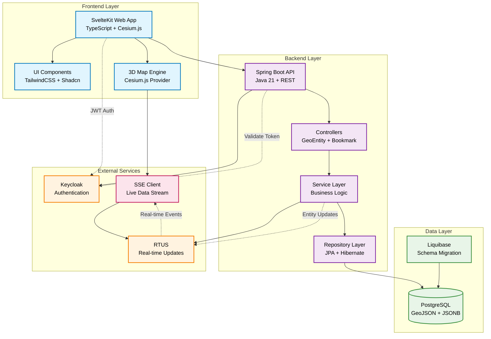
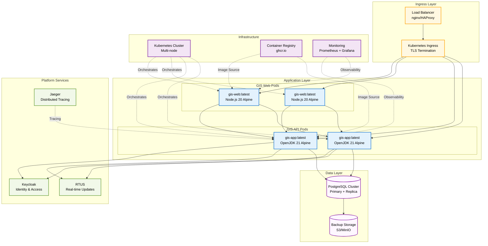

# AGIL Ops Hub - GIS System Architecture Diagrams

This document contains comprehensive architecture diagrams for the AGIL Ops Hub Geographical Information System (GIS).

## System Architecture

## Deployment Architecture

## Data Flow Architecture

```mermaid
sequenceDiagram
    participant U as User Browser
    participant W as SvelteKit Web
    participant A as Spring Boot API
    participant K as Keycloak
    participant D as PostgreSQL
    participant R as RTUS
    participant S as SSE Stream

    %% Authentication Flow
    Note over U,K: Authentication Flow
    U->>W: Access GIS Application
    W->>K: Redirect to Login
    K->>U: Authentication Form
    U->>K: Credentials<br/>{username, password}
    K->>W: JWT Token + User Info<br/>{<br/>  "access_token": "eyJ...",<br/>  "refresh_token": "eyJ...",<br/>  "expires_in": 3600,<br/>  "token_type": "Bearer"<br/>}
    W->>U: Authenticated Session

    %% Initial Data Load
    Note over U,D: Initial Data Load
    U->>W: Request GIS Page
    W->>A: GET /geoentity?page=0&size=10<br/>Headers: {Authorization: "Bearer eyJ..."}
    A->>K: Validate JWT Token<br/>Token Payload: {<br/>  "sub": "user-uuid",<br/>  "tenant_id": "tenant-123",<br/>  "exp": 1640995200<br/>}
    K->>A: Token Valid + Tenant Info<br/>{<br/>  "valid": true,<br/>  "tenant_id": "tenant-123",<br/>  "user_id": "user-uuid"<br/>}
    A->>D: Query GeoEntities by Tenant<br/>SELECT * FROM geo_entity<br/>WHERE tenant_id = 'tenant-123'<br/>LIMIT 10 OFFSET 0
    D->>A: GeoEntity Data (GeoJSON)<br/>[{<br/>  "id": "550e8400-e29b-41d4-a716-446655440000",<br/>  "entity_id": "vehicle-001",<br/>  "entity_type": "track",<br/>  "geojson": {<br/>    "type": "Feature",<br/>    "geometry": {<br/>      "type": "Point",<br/>      "coordinates": [103.8198, 1.3521]<br/>    },<br/>    "properties": {<br/>      "kind": "vehicle",<br/>      "name": "Vehicle 1"<br/>    }<br/>  },<br/>  "occ_lock": 1<br/>}]
    A->>W: Paginated Entity Response<br/>{<br/>  "data": [...],<br/>  "page": {<br/>    "number": 0,<br/>    "size": 10,<br/>    "total_records": 25<br/>  }<br/>}
    W->>U: Render 3D Map + Entities

    %% Real-time Updates Setup
    Note over U,R: Real-time Connection
    W->>S: Establish SSE Connection<br/>GET /sse/map-updates<br/>Headers: {Accept: "text/event-stream"}
    S->>R: Subscribe to Map Updates<br/>Topic: "tenant-123/map-updates"
    R->>S: Subscription Confirmed<br/>event: connected<br/>data: {"status": "subscribed"}

    %% Entity Creation Flow
    Note over U,R: Entity Creation
    U->>W: Create New GeoEntity<br/>Form Data: {<br/>  "entity_id": "vehicle-002",<br/>  "entity_type": "track",<br/>  "geojson": {<br/>    "type": "Feature",<br/>    "geometry": {<br/>      "type": "Point",<br/>      "coordinates": [103.8200, 1.3525]<br/>    },<br/>    "properties": {<br/>      "kind": "vehicle",<br/>      "name": "Vehicle 2"<br/>    }<br/>  }<br/>}
    W->>A: POST /geoentity<br/>Headers: {Authorization: "Bearer eyJ..."}
    A->>K: Validate JWT Token
    A->>D: INSERT GeoEntity<br/>INSERT INTO geo_entity<br/>(id, entity_id, entity_type, geojson, tenant_id, created_by)<br/>VALUES (uuid_generate_v4(), 'vehicle-002', 'track', {...}, 'tenant-123', 'user-uuid')
    D->>A: Entity Created (with ID)<br/>{<br/>  "id": "660e8400-e29b-41d4-a716-446655440001",<br/>  "entity_id": "vehicle-002",<br/>  "occ_lock": 1<br/>}
    A->>R: Notify Entity Added<br/>POST /tenants/tenant-123/json-maps/gis-map/keys/660e8400-...<br/>{<br/>  "id": "660e8400-e29b-41d4-a716-446655440001",<br/>  "entity_id": "vehicle-002",<br/>  "entity_type": "track",<br/>  "geojson": {...}<br/>}
    A->>W: Creation Success Response<br/>{<br/>  "message": "Geoentity created",<br/>  "data": {<br/>    "id": "660e8400-e29b-41d4-a716-446655440001",<br/>    "entity_id": "vehicle-002",<br/>    "entity_type": "track",<br/>    "geojson": {...},<br/>    "occ_lock": 1<br/>  }<br/>}
    W->>U: Update UI Confirmation

    %% Real-time Propagation
    Note over R,U: Real-time Updates
    R->>S: Broadcast Entity Added Event<br/>event: entity-added<br/>data: {<br/>  "id": "660e8400-e29b-41d4-a716-446655440001",<br/>  "entity_id": "vehicle-002",<br/>  "entity_type": "track",<br/>  "geojson": {...},<br/>  "action": "CREATE"<br/>}
    S->>W: SSE Event: Entity Added
    W->>U: Update Map (New Entity)

    %% Entity Updates
    Note over U,R: Entity Updates
    U->>W: Modify Entity Position<br/>New Coordinates: [103.8205, 1.3530]
    W->>A: PATCH /geoentity/660e8400-e29b-41d4-a716-446655440001<br/>Headers: {Authorization: "Bearer eyJ..."}<br/>Body: {<br/>  "geojson": {<br/>    "type": "Feature",<br/>    "geometry": {<br/>      "type": "Point",<br/>      "coordinates": [103.8205, 1.3530]<br/>    },<br/>    "properties": {<br/>      "kind": "vehicle",<br/>      "name": "Vehicle 2"<br/>    }<br/>  },<br/>  "occ_lock": 1<br/>}
    A->>K: Validate JWT Token
    A->>D: UPDATE GeoEntity<br/>UPDATE geo_entity<br/>SET geojson = {...}, occ_lock = occ_lock + 1<br/>WHERE id = '660e8400-...' AND tenant_id = 'tenant-123'
    D->>A: Entity Updated<br/>{<br/>  "id": "660e8400-e29b-41d4-a716-446655440001",<br/>  "occ_lock": 2<br/>}
    A->>R: Notify Entity Updated<br/>POST /tenants/tenant-123/json-maps/gis-map/keys/660e8400-...
    A->>W: Update Success Response<br/>{<br/>  "message": "Geoentity updated",<br/>  "data": {<br/>    "id": "660e8400-e29b-41d4-a716-446655440001",<br/>    "occ_lock": 2,<br/>    "geojson": {...}<br/>  }<br/>}
    R->>S: Broadcast Entity Updated Event<br/>event: entity-updated<br/>data: {<br/>  "id": "660e8400-e29b-41d4-a716-446655440001",<br/>  "geojson": {...},<br/>  "action": "UPDATE"<br/>}
    S->>W: SSE Event: Entity Updated
    W->>U: Update Map Position

    %% Bookmark Management
    Note over U,D: Bookmark Flow
    U->>W: Save Map Bookmark<br/>Camera Position: {<br/>  "name": "Downtown View",<br/>  "lon": 103.8198,<br/>  "lat": 1.3521,<br/>  "alt": 500.0,<br/>  "zoom": 15.0,<br/>  "pitch": -45.0,<br/>  "yaw": 0.0,<br/>  "roll": 0.0<br/>}
    W->>A: POST /bookmark<br/>Headers: {Authorization: "Bearer eyJ..."}<br/>Body: {<br/>  "name": "Downtown View",<br/>  "lon": 103.8198,<br/>  "lat": 1.3521,<br/>  "alt": 500.0,<br/>  "zoom": 15.0,<br/>  "pitch": -45.0,<br/>  "yaw": 0.0,<br/>  "roll": 0.0<br/>}
    A->>K: Validate JWT Token
    A->>D: INSERT Bookmark<br/>INSERT INTO bookmark<br/>(id, name, lon, lat, alt, zoom, pitch, yaw, roll, tenant_id, created_by)<br/>VALUES (uuid_generate_v4(), 'Downtown View', 103.8198, 1.3521, 500.0, 15.0, -45.0, 0.0, 0.0, 'tenant-123', 'user-uuid')
    D->>A: Bookmark Saved<br/>{<br/>  "id": "770e8400-e29b-41d4-a716-446655440002",<br/>  "occ_lock": 1<br/>}
    A->>W: Bookmark Created<br/>{<br/>  "message": "Bookmark created",<br/>  "data": {<br/>    "id": "770e8400-e29b-41d4-a716-446655440002",<br/>    "name": "Downtown View",<br/>    "lon": 103.8198,<br/>    "lat": 1.3521,<br/>    "alt": 500.0,<br/>    "zoom": 15.0,<br/>    "pitch": -45.0,<br/>    "yaw": 0.0,<br/>    "roll": 0.0,<br/>    "occ_lock": 1<br/>  }<br/>}
    W->>U: Bookmark Available

    %% Error Handling
    Note over A,U: Error Scenarios
    alt JWT Token Expired
        W->>A: API Request (Expired JWT)<br/>Headers: {Authorization: "Bearer expired_token"}
        A->>K: Validate JWT Token
        K->>A: Token Expired<br/>{<br/>  "error": "token_expired",<br/>  "exp": 1640991600<br/>}
        A->>W: 401 Unauthorized<br/>{<br/>  "error": "Unauthorized",<br/>  "message": "Expired access token"<br/>}
        W->>K: Refresh Token Flow<br/>POST /auth/refresh<br/>Body: {<br/>  "refresh_token": "eyJ..."<br/>}
        K->>W: New JWT Token<br/>{<br/>  "access_token": "eyJ...",<br/>  "expires_in": 3600<br/>}
        W->>A: Retry Request<br/>Headers: {Authorization: "Bearer new_token"}
    end

    alt Database Connection Error
        A->>D: Query Request<br/>SELECT * FROM geo_entity WHERE tenant_id = 'tenant-123'
        D-->>A: Connection Failed<br/>{<br/>  "error": "connection_timeout",<br/>  "code": "08006"<br/>}
        A->>W: 500 Internal Server Error<br/>{<br/>  "error": "Internal Server Error",<br/>  "message": "Database connection failed"<br/>}
        W->>U: Error Message + Retry<br/>Toast: "Connection error. Please try again."
    end

    alt Optimistic Lock Conflict
        W->>A: PATCH /geoentity/660e8400-...<br/>Body: {<br/>  "geojson": {...},<br/>  "occ_lock": 1<br/>}
        A->>D: UPDATE geo_entity<br/>WHERE id = '660e8400-...' AND occ_lock = 1
        D->>A: No Rows Updated<br/>(Entity was modified by another user)
        A->>W: 409 Conflict<br/>{<br/>  "error": "OptimisticLockException",<br/>  "message": "Entity has been modified. Please refresh and try again."<br/>}
        W->>U: Conflict Resolution<br/>Modal: "Entity was updated by another user. Refresh to see latest changes?"
    end
```

## Architecture Highlights

### Key Components

1. **Frontend (SvelteKit)**

   - TypeScript-based with Svelte 5 reactivity
   - Cesium.js for 3D geospatial visualization
   - TailwindCSS + custom component library
   - Real-time updates via Server-Sent Events (SSE)

2. **Backend (Spring Boot)**

   - Java 21 with Spring Boot 3.4.4
   - RESTful API with layered architecture
   - JWT-based authentication with Keycloak integration
   - Multi-tenant data isolation

3. **Database (PostgreSQL)**

   - GeoJSON storage with JSONB columns
   - Liquibase for schema migrations
   - Optimized for geospatial queries
   - Connection pooling with HikariCP

4. **Real-time System (RTUS)**
   - Server-Sent Events for live updates
   - Entity change propagation
   - Batch processing for performance

### Security Features

- JWT token validation on all API endpoints
- Multi-tenant data isolation by tenant_id
- OIDC integration with Keycloak
- Secure container deployment

### Performance Optimizations

- Database connection pooling
- JPA batch operations
- Frontend code splitting
- Cesium.js 3D rendering optimizations
- Real-time update batching

### Deployment Strategy

- Containerized microservices architecture
- Kubernetes orchestration
- Multi-replica deployment for high availability
- Container registry integration (ghcr.io)
- Distributed tracing with Jaeger
- Monitoring with Prometheus/Grafana
