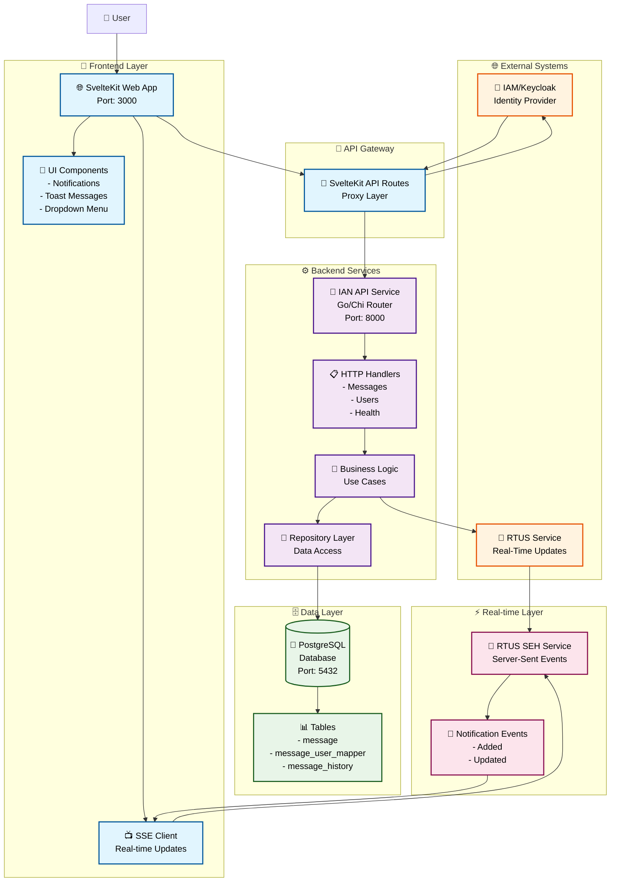
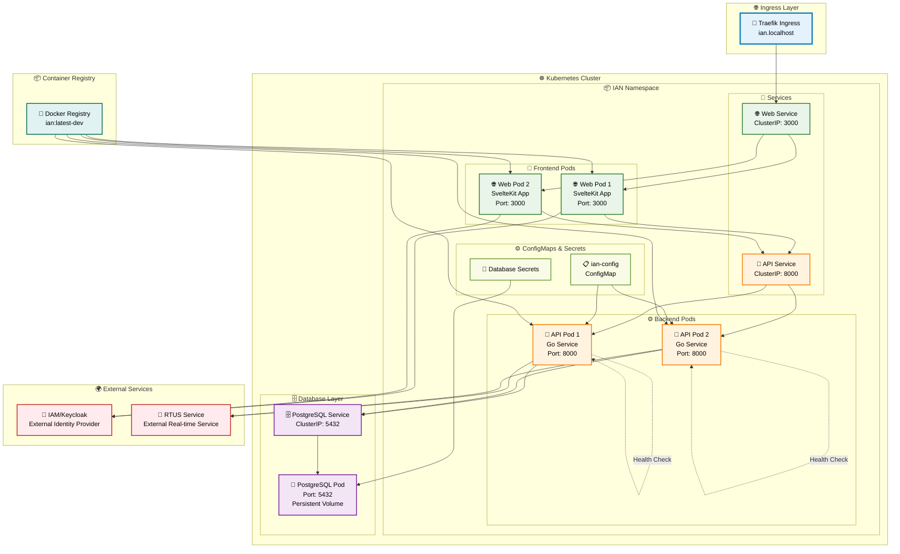
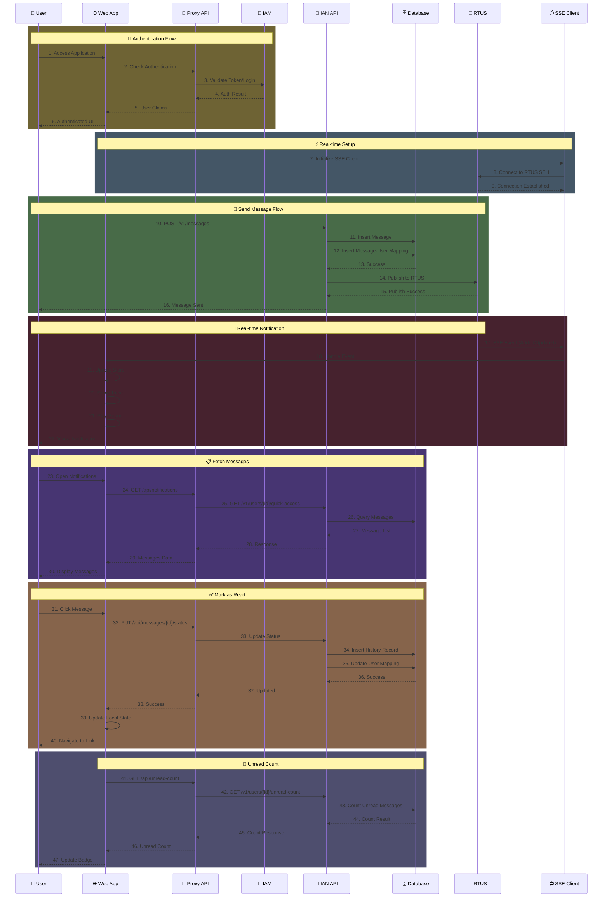

## System Architecture Diagram

```mermaid
graph TB
    %% External Systems
    subgraph "🌐 External Systems"
        IAM[🔐 IAM/Keycloak<br/>Identity Provider]
        RTUS[📡 RTUS Service<br/>Real-Time Updates]
    end

    %% Frontend Layer
    subgraph "🎨 Frontend Layer"
        WEB[🌐 SvelteKit Web App<br/>Port: 3000]
        UI[🎯 UI Components<br/>- Notifications<br/>- Toast Messages<br/>- Dropdown Menu]
        SSE[📺 SSE Client<br/>Real-time Updates]
    end

    %% API Gateway/Proxy Layer
    subgraph "🚪 API Gateway"
        PROXY[🔄 SvelteKit API Routes<br/>Proxy Layer]
    end

    %% Backend Services
    subgraph "⚙️ Backend Services"
        IAN_API[🔔 IAN API Service<br/>Go/Chi Router<br/>Port: 8000]
        HANDLERS[📋 HTTP Handlers<br/>- Messages<br/>- Users<br/>- Health]
        USECASE[🎯 Business Logic<br/>Use Cases]
        REPO[💾 Repository Layer<br/>Data Access]
    end

    %% Data Layer
    subgraph "🗄️ Data Layer"
        POSTGRES[(🐘 PostgreSQL<br/>Database<br/>Port: 5432)]
        TABLES[📊 Tables<br/>- message<br/>- message_user_mapper<br/>- message_history]
    end

    %% Real-time Communication
    subgraph "⚡ Real-time Layer"
        RTUS_SEH[📡 RTUS SEH Service<br/>Server-Sent Events]
        NOTIFICATIONS[🔔 Notification Events<br/>- Added<br/>- Updated]
    end

    %% User Interactions
    USER[👤 User] --> WEB
    WEB --> UI
    WEB --> SSE
    WEB --> PROXY

    %% Authentication Flow
    PROXY --> IAM
    IAM --> PROXY

    %% API Communication
    PROXY --> IAN_API
    IAN_API --> HANDLERS
    HANDLERS --> USECASE
    USECASE --> REPO
    REPO --> POSTGRES
    POSTGRES --> TABLES

    %% Real-time Flow
    USECASE --> RTUS
    RTUS --> RTUS_SEH
    RTUS_SEH --> NOTIFICATIONS
    SSE --> RTUS_SEH
    NOTIFICATIONS --> SSE

    %% Styling
    classDef frontend fill:#e1f5fe,stroke:#01579b,stroke-width:2px,color:#000
    classDef backend fill:#f3e5f5,stroke:#4a148c,stroke-width:2px,color:#000
    classDef database fill:#e8f5e8,stroke:#1b5e20,stroke-width:2px,color:#000
    classDef external fill:#fff3e0,stroke:#e65100,stroke-width:2px,color:#000
    classDef realtime fill:#fce4ec,stroke:#880e4f,stroke-width:2px,color:#000

    class WEB,UI,SSE,PROXY frontend
    class IAN_API,HANDLERS,USECASE,REPO backend
    class POSTGRES,TABLES database
    class IAM,RTUS external
    class RTUS_SEH,NOTIFICATIONS realtime
```

## Deployment Architecture Diagram

```mermaid
graph TB
    %% Load Balancer/Ingress
    subgraph "🌐 Ingress Layer"
        TRAEFIK[🚦 Traefik Ingress<br/>ian.localhost]
    end

    %% Kubernetes Cluster
    subgraph "☸️ Kubernetes Cluster"
        subgraph "📦 IAN Namespace"
            subgraph "🎨 Frontend Pods"
                WEB_POD1[🌐 Web Pod 1<br/>SvelteKit App<br/>Port: 3000]
                WEB_POD2[🌐 Web Pod 2<br/>SvelteKit App<br/>Port: 3000]
            end
            
            subgraph "⚙️ Backend Pods"
                API_POD1[🔔 API Pod 1<br/>Go Service<br/>Port: 8000]
                API_POD2[🔔 API Pod 2<br/>Go Service<br/>Port: 8000]
            end
            
            subgraph "🔧 Services"
                WEB_SVC[🌐 Web Service<br/>ClusterIP: 3000]
                API_SVC[🔔 API Service<br/>ClusterIP: 8000]
            end
            
            subgraph "⚙️ ConfigMaps & Secrets"
                CONFIG[📋 ian-config<br/>ConfigMap]
                SECRETS[🔐 Database Secrets]
            end
        end
        
        subgraph "🗄️ Database Layer"
            POSTGRES_POD[🐘 PostgreSQL Pod<br/>Port: 5432<br/>Persistent Volume]
            POSTGRES_SVC[🗄️ PostgreSQL Service<br/>ClusterIP: 5432]
        end
    end

    %% External Services
    subgraph "🌍 External Services"
        IAM_EXT[🔐 IAM/Keycloak<br/>External Identity Provider]
        RTUS_EXT[📡 RTUS Service<br/>External Real-time Service]
    end

    %% Docker Registry
    subgraph "📦 Container Registry"
        REGISTRY[🐳 Docker Registry<br/>ian:latest-dev]
    end

    %% Connections
    TRAEFIK --> WEB_SVC
    WEB_SVC --> WEB_POD1
    WEB_SVC --> WEB_POD2
    
    WEB_POD1 --> API_SVC
    WEB_POD2 --> API_SVC
    API_SVC --> API_POD1
    API_SVC --> API_POD2
    
    API_POD1 --> POSTGRES_SVC
    API_POD2 --> POSTGRES_SVC
    POSTGRES_SVC --> POSTGRES_POD
    
    CONFIG --> API_POD1
    CONFIG --> API_POD2
    SECRETS --> POSTGRES_POD
    
    WEB_POD1 --> IAM_EXT
    WEB_POD2 --> IAM_EXT
    API_POD1 --> RTUS_EXT
    API_POD2 --> RTUS_EXT
    
    REGISTRY --> API_POD1
    REGISTRY --> API_POD2
    REGISTRY --> WEB_POD1
    REGISTRY --> WEB_POD2

    %% Health Checks
    API_POD1 -.->|Health Check| API_POD1
    API_POD2 -.->|Health Check| API_POD2

    %% Styling
    classDef ingress fill:#e3f2fd,stroke:#0277bd,stroke-width:3px,color:#000
    classDef frontend fill:#e8f5e8,stroke:#2e7d32,stroke-width:2px,color:#000
    classDef backend fill:#fff3e0,stroke:#f57c00,stroke-width:2px,color:#000
    classDef database fill:#f3e5f5,stroke:#7b1fa2,stroke-width:2px,color:#000
    classDef external fill:#ffebee,stroke:#c62828,stroke-width:2px,color:#000
    classDef config fill:#f9fbe7,stroke:#689f38,stroke-width:2px,color:#000
    classDef registry fill:#e0f2f1,stroke:#00695c,stroke-width:2px,color:#000

    class TRAEFIK ingress
    class WEB_POD1,WEB_POD2,WEB_SVC frontend
    class API_POD1,API_POD2,API_SVC backend
    class POSTGRES_POD,POSTGRES_SVC database
    class IAM_EXT,RTUS_EXT external
    class CONFIG,SECRETS config
    class REGISTRY registry
```

Data Flow Diagram

```mermaid
sequenceDiagram
    participant U as 👤 User
    participant W as 🌐 Web App
    participant P as 🔄 Proxy API
    participant I as 🔐 IAM
    participant A as 🔔 IAN API
    participant D as 🗄️ Database
    participant R as 📡 RTUS
    participant S as 📺 SSE Client

    %% Authentication Flow
    rect rgb(110, 99, 52)
        Note over U,I: 🔐 Authentication Flow
        U->>W: 1. Access Application
        W->>P: 2. Check Authentication
        P->>I: 3. Validate Token/Login
        I-->>P: 4. Auth Result
        P-->>W: 5. User Claims
        W-->>U: 6. Authenticated UI
    end

    %% Real-time Connection Setup
    rect rgb(68, 86, 102)
        Note over W,S: ⚡ Real-time Setup
        W->>S: 7. Initialize SSE Client
        S->>R: 8. Connect to RTUS SEH
        R-->>S: 9. Connection Established
    end

    %% Message Creation Flow
    rect rgb(72, 107, 72)
        Note over U,R: 📝 Send Message Flow
        U->>A: 10. POST /v1/messages
        A->>D: 11. Insert Message
        A->>D: 12. Insert Message-User Mapping
        D-->>A: 13. Success
        A->>R: 14. Publish to RTUS
        R-->>A: 15. Publish Success
        A-->>U: 16. Message Sent
    end

    %% Real-time Notification Flow
    rect rgb(70, 34, 46)
        Note over R,U: 🔔 Real-time Notification
        R->>S: 17. SSE Event (Added/Updated)
        S->>W: 18. Handle Event
        W->>W: 19. Update Store
        W->>W: 20. Show Toast
        W->>W: 21. Play Sound
        W-->>U: 22. Visual Notification
    end

    %% Message Retrieval Flow
    rect rgb(71, 53, 114)
        Note over U,D: 📋 Fetch Messages
        U->>W: 23. Open Notifications
        W->>P: 24. GET /api/notifications
        P->>A: 25. GET /v1/users/{id}/quick-access
        A->>D: 26. Query Messages
        D-->>A: 27. Message List
        A-->>P: 28. Response
        P-->>W: 29. Messages Data
        W-->>U: 30. Display Messages
    end

    %% Message Status Update Flow
    rect rgb(134, 100, 75)
        Note over U,D: ✅ Mark as Read
        U->>W: 31. Click Message
        W->>P: 32. PUT /api/messages/{id}/status
        P->>A: 33. Update Status
        A->>D: 34. Insert History Record
        A->>D: 35. Update User Mapping
        D-->>A: 36. Success
        A-->>P: 37. Updated
        P-->>W: 38. Success
        W->>W: 39. Update Local State
        W-->>U: 40. Navigate to Link
    end

    %% Unread Count Flow
    rect rgb(78, 78, 110)
        Note over W,D: 🔢 Unread Count
        W->>P: 41. GET /api/unread-count
        P->>A: 42. GET /v1/users/{id}/unread-count
        A->>D: 43. Count Unread Messages
        D-->>A: 44. Count Result
        A-->>P: 45. Count Response
        P-->>W: 46. Unread Count
        W-->>U: 47. Update Badge
    end
```

