# RMT API Sequence Diagrams

This document contains sequence diagrams showing the behind-the-scene flow when making API calls to the Resource Management and Tasking (RMT) system.

## 🎨 Diagram Styling
These diagrams use vibrant, professional colors optimized for both dark and light themes with clear readability.

---

## 📋 Task Management API Flows

### 1. Create Task Flow

```mermaid
sequenceDiagram
    participant Client
    participant Handler as TaskHandler
    participant Middleware
    participant TaskService
    participant LocationService
    participant TaskRepo as TaskRepository
    participant AttrRepo as AttributeRepository
    participant LocRepo as LocationRepository
    participant GisService
    participant Database
    participant GIS as External GIS

    Note over Client,GIS: 🚀 POST /v1/task - Create New Task
    
    Client->>+Handler: POST /v1/task<br/>📦 taskPayload{<br/>  title, description, task_type,<br/>  priority, status, attributes[],<br/>  locations[], plan_start_on<br/>}
    
    Handler->>+Middleware: GetJwt(request)
    Middleware-->>-Handler: 🔐 JwtClaim{<br/>  id, active_tenant{id, name}<br/>}
    
    Handler->>Handler: 🔄 Transform Request<br/>📋 taskPayload → model.TaskAttribute{<br/>  Task: entity.Task{id, title, priority...},<br/>  Attributes: []entity.Attribute,<br/>  Locations: []model.Location<br/>}
    
    Handler->>+TaskService: CreateTask(ctx, taskAttribute)
    
    TaskService->>TaskService: 🔄 normalizeCreateTaskRequest()<br/>- Generate UUIDs<br/>- Set entity relationships<br/>- Validate time constraints
    
    TaskService->>+Database: BeginTx()
    Database-->>-TaskService: 📄 Transaction
    
    TaskService->>+TaskRepo: CreateTask(ctx, tx, task)
    TaskRepo->>Database: INSERT INTO task<br/>💾 (id, title, description, task_type,<br/>priority, status, created_by, tenant_id...)
    TaskRepo-->>-TaskService: ✅ Success
    
    TaskService->>+AttrRepo: CreateAttributes(ctx, tx, attributes)
    AttrRepo->>Database: INSERT INTO attribute<br/>💾 (id, name, value, entity_id,<br/>entity_type, attribute_type...)
    AttrRepo-->>-TaskService: ✅ Success
    
    TaskService->>+LocationService: CreateLocations(ctx, tx, locations)
    LocationService->>LocationService: 🔄 normalizeCreateLocationRequest()<br/>- Generate location UUIDs<br/>- Format GeoJSON
    
    LocationService->>+LocRepo: UpsertLocations(ctx, tx, locations)
    LocRepo->>Database: INSERT INTO location<br/>💾 (id, name, type, geometry_type,<br/>geo_json, entity_id, entity_type...)
    LocRepo-->>-LocationService: 📍 []locationIds
    
    LocationService->>+GisService: UpsertBatchGeoentity(ctx, domain, locations)
    GisService->>+GIS: POST /gis/api/geoentities<br/>📡 {geoentities: [{entity_id, entity_type, geojson}]}
    GIS-->>-GisService: ✅ GIS Updated
    GisService-->>-LocationService: ✅ Success
    
    LocationService-->>-TaskService: 📍 []entity.Location
    
    TaskService->>Database: Commit()
    TaskService-->>-Handler: 📋 model.TaskAttribute{<br/>  Task{id, title...},<br/>  Attributes[], Locations[]<br/>}
    
    Handler-->>-Client: 🎉 200 OK<br/>📦 {data: {id: "task-uuid"}}
```

### 2. Get Task by ID Flow

```mermaid
sequenceDiagram
    participant Client
    participant Handler as TaskHandler
    participant TaskService
    participant TaskRepo as TaskRepository
    participant AttrRepo as AttributeRepository
    participant LocationService
    participant LocRepo as LocationRepository
    participant Database

    Note over Client,Database: 🔍 GET /v1/task/{id} - Retrieve Task Details
    
    Client->>+Handler: GET /v1/task/{task-id}
    
    Handler->>Handler: 🔍 Extract & Validate UUID<br/>📝 idUriParam{id} → uuid.UUID
    
    Handler->>+TaskService: GetTaskById(ctx, taskId)
    
    TaskService->>+TaskRepo: GetTaskById(ctx, db, taskId)
    TaskRepo->>Database: SELECT * FROM task WHERE id = $1<br/>🔍 Query: taskId
    Database-->>TaskRepo: 📋 Task Row Data
    TaskRepo->>TaskRepo: 🔄 Scan into entity.Task{<br/>  id, title, description, task_type,<br/>  priority, status, created_at...<br/>}
    TaskRepo-->>-TaskService: 📋 *entity.Task
    
    TaskService->>+AttrRepo: GetAttributesByEntityId(ctx, db, taskId, "task")
    AttrRepo->>Database: SELECT * FROM attribute<br/>WHERE entity_id = $1 AND entity_type = $2<br/>🔍 Query: taskId, "task"
    Database-->>AttrRepo: 📊 Attribute Rows
    AttrRepo-->>-TaskService: 📊 []entity.Attribute
    
    TaskService->>+LocationService: GetLocationsByEntityId(ctx, db, taskId)
    LocationService->>+LocRepo: GetLocationsByEntityId(ctx, db, taskId)
    LocRepo->>Database: SELECT * FROM location<br/>WHERE entity_id = $1<br/>🔍 Query: taskId
    Database-->>LocRepo: 📍 Location Rows
    LocRepo-->>-LocationService: 📍 []entity.Location
    LocationService-->>-TaskService: 📍 []entity.Location
    
    TaskService->>TaskService: 🔄 Assemble Response<br/>📦 model.TaskResponse{<br/>  Task, Attributes[], Locations[]<br/>}
    TaskService-->>-Handler: 📦 *model.TaskResponse
    
    Handler->>Handler: 🔄 Transform to Response<br/>📋 getTaskResponse{<br/>  taskResponse{id, title, priority...},<br/>  Attributes[], Locations[]<br/>}
    
    Handler-->>-Client: 🎉 200 OK<br/>📦 Complete Task Details
```

### 3. List Tasks with Pagination Flow

```mermaid
sequenceDiagram
    participant Client
    participant Handler as TaskHandler
    participant TaskService
    participant TaskRepo as TaskRepository
    participant Database

    Note over Client,Database: 📋 GET /v1/task?page=1&size=10&title=search - List Tasks
    
    Client->>+Handler: GET /v1/task?page=1&size=10&title=search&status=PENDING
    
    Handler->>Handler: 🔍 Parse Query Parameters<br/>📝 listTasksParams{<br/>  taskFilter{title, type, priority, status},<br/>  paginationParams{page, size, sort}<br/>}
    
    Handler->>+TaskService: ListTasks(ctx, filter)
    Note over TaskService: 📊 repository.ListTaskFilter{<br/>  Title, TaskType, Priority, Status,<br/>  PaginationFilter{Page, Size, Sort}<br/>}
    
    TaskService->>TaskService: 🔄 normalizePaginationFilter()<br/>- Set defaults: page=1, size=10<br/>- Default sort: "created_at:desc"
    
    par Fetch Tasks
        TaskService->>+TaskRepo: ListTasks(ctx, db, filter)
        TaskRepo->>TaskRepo: 🔄 Build Dynamic Query<br/>📝 SELECT * FROM task<br/>WHERE title ILIKE %search%<br/>AND status = 'PENDING'<br/>ORDER BY created_at DESC<br/>LIMIT 10 OFFSET 0
        TaskRepo->>Database: Execute Query with Filters
        Database-->>TaskRepo: 📋 Task Rows (Page 1)
        TaskRepo-->>-TaskService: 📋 []entity.Task
    and Count Total
        TaskService->>+TaskRepo: CountTasks(ctx, db, filter)
        TaskRepo->>Database: SELECT COUNT(*) FROM task<br/>WHERE title ILIKE %search%<br/>AND status = 'PENDING'
        Database-->>TaskRepo: 🔢 Total Count
        TaskRepo-->>-TaskService: 🔢 totalRecords: 25
    end
    
    TaskService->>TaskService: 🔄 Build Response<br/>📦 model.ListTasksResponse{<br/>  Tasks: []entity.Task,<br/>  PaginationResponse{<br/>    TotalRecords: 25, Number: 1,<br/>    Size: 10, Count: 10<br/>  }<br/>}
    TaskService-->>-Handler: 📦 *model.ListTasksResponse
    
    Handler->>Handler: 🔄 Transform Response<br/>📋 []taskResponse + PageResponse{<br/>  total_records, number, size, count<br/>}
    
    Handler-->>-Client: 🎉 200 OK<br/>📦 Paginated Task List + Metadata
```

### 4. Update Task Flow

### 5. Delete Task Flow

```mermaid
sequenceDiagram
    participant Client
    participant Handler as TaskHandler
    participant TaskService
    participant TaskRepo as TaskRepository
    participant AttrRepo as AttributeRepository
    participant AssignRepo as AssignmentRepository
    participant LocationService
    participant TaskNoteRepo
    participant TaskChecklistRepo
    participant Database

    Note over Client,Database: 🗑️ DELETE /v1/task/{id} - Delete Task & Related Data
    
    Client->>+Handler: DELETE /v1/task/{task-id}
    
    Handler->>Handler: 🔍 Extract & Validate ID
    Handler->>+TaskService: DeleteTask(ctx, taskId)
    
    TaskService->>+Database: BeginTx()
    Database-->>-TaskService: 📄 Transaction
    
    Note over TaskService,Database: 🧹 Cascade Delete in Proper Order
    
    par Delete Related Data
        TaskService->>+AttrRepo: DeleteAttributesByEntityId(ctx, tx, taskId)
        AttrRepo->>Database: DELETE FROM attribute<br/>WHERE entity_id = $1
        AttrRepo-->>-TaskService: ✅ Attributes Deleted
    and
        TaskService->>+AssignRepo: DeleteAssignmentsByTaskID(ctx, tx, taskId)
        AssignRepo->>Database: DELETE FROM assignment<br/>WHERE task_id = $1
        AssignRepo-->>-TaskService: ✅ Assignments Deleted
    and
        TaskService->>+LocationService: DeleteLocationsByEntityId(ctx, tx, taskId)
        LocationService->>Database: DELETE FROM location<br/>WHERE entity_id = $1
        LocationService-->>-TaskService: ✅ Locations Deleted
    and
        TaskService->>+TaskNoteRepo: DeleteTaskNotesByTaskId(ctx, tx, taskId)
        TaskNoteRepo->>Database: DELETE FROM task_note<br/>WHERE task_id = $1
        TaskNoteRepo-->>-TaskService: ✅ Notes Deleted
    and
        TaskService->>+TaskChecklistRepo: DeleteTaskChecklistsByTaskId(ctx, tx, taskId)
        TaskChecklistRepo->>Database: DELETE FROM task_checklist<br/>WHERE task_id = $1
        TaskChecklistRepo-->>-TaskService: ✅ Checklists Deleted
    end
    
    TaskService->>+TaskRepo: DeleteTask(ctx, tx, taskId)
    TaskRepo->>Database: DELETE FROM task<br/>WHERE id = $1<br/>🗑️ Final Task Deletion
    TaskRepo-->>-TaskService: ✅ Task Deleted
    
    TaskService->>Database: Commit()
    TaskService-->>-Handler: ✅ Success
    
    Handler-->>-Client: 🎉 200 OK<br/>📦 {status: "deleted"}
```

---

## 🏗️ Resource Management API Flows

### 1. Create Resource Flow

```mermaid
sequenceDiagram
    participant Client
    participant Handler as ResourceHandler
    participant Middleware
    participant ResourceService
    participant LocationService
    participant ResourceRepo
    participant AttrRepo as AttributeRepository
    participant PersonnelRepo
    participant Database

    Note over Client,Database: 🏗️ POST /v1/resource - Create New Resource
    
    Client->>+Handler: POST /v1/resource<br/>📦 resourcePayload{<br/>  name, description, resource_type: "personnel",<br/>  status, attributes[], locations[],<br/>  extension: {user_id: "uuid"}<br/>}
    
    Handler->>+Middleware: GetJwt(request)
    Middleware-->>-Handler: 🔐 JwtClaim
    
    Handler->>Handler: 🔄 Transform & Normalize<br/>📋 model.ResourceAttribute{<br/>  Resource: entity.Resource,<br/>  Attributes: []entity.Attribute,<br/>  Extension: *ResourceExtension,<br/>  Locations: []model.Location<br/>}
    
    Handler->>+ResourceService: CreateResource(ctx, resourceAttribute)
    
    ResourceService->>ResourceService: 🔄 normalizeCreateResourceRequest()<br/>- Generate resource UUID<br/>- Set entity relationships<br/>- Process extension data
    
    ResourceService->>+Database: BeginTx()
    Database-->>-ResourceService: 📄 Transaction
    
    ResourceService->>+ResourceRepo: CreateResource(ctx, tx, resource)
    ResourceRepo->>Database: INSERT INTO resource<br/>💾 (id, name, description, resource_type,<br/>status, created_by, tenant_id...)
    ResourceRepo-->>-ResourceService: ✅ Success
    
    ResourceService->>+ResourceService: proceedResourceExtension(ctx, resource, tx)
    Note over ResourceService: 🔄 Handle Resource Type Extensions
    alt Resource Type: Personnel
        ResourceService->>+PersonnelRepo: UpsertPersonnel(ctx, tx, personnel)
        PersonnelRepo->>Database: INSERT INTO personnel<br/>💾 (id, user_id)
        PersonnelRepo-->>-ResourceService: ✅ Personnel Created
    else Resource Type: Equipment
        Note over ResourceService: No extension needed
    end
    ResourceService-->>-ResourceService: ✅ Extension Processed
    
    ResourceService->>+AttrRepo: CreateAttributes(ctx, tx, attributes)
    AttrRepo->>Database: INSERT INTO attribute<br/>💾 (id, name, value, entity_id: resource_id,<br/>entity_type: "resource"...)
    AttrRepo-->>-ResourceService: ✅ Success
    
    ResourceService->>+LocationService: CreateLocations(ctx, tx, locations)
    LocationService-->>-ResourceService: 📍 []entity.Location
    
    ResourceService->>Database: Commit()
    ResourceService-->>-Handler: 📋 *model.ResourceAttribute
    
    Handler-->>-Client: 🎉 200 OK<br/>📦 {data: {id: "resource-uuid"}}
```

### 2. Get Resource by ID Flow

---

## 📝 Assignment Management API Flows

### 1. Assign Resources to Task Flow

### 2. List Task Assignments Flow

```mermaid
sequenceDiagram
    participant Client
    participant Handler as TaskHandler
    participant TaskService
    participant AssignRepo as AssignmentRepository
    participant Database

    Note over Client,Database: 📋 GET /v1/task/{id}/assignment - List Assignments
    
    Client->>+Handler: GET /v1/task/{task-id}/assignment?page=1&size=10&status=ACTIVE
    
    Handler->>Handler: 🔍 Parse Parameters<br/>📝 listTaskAssignmentsParams{<br/>  assignmentFilter{type, status, priority},<br/>  paginationParams{page, size, sort}<br/>}
    
    Handler->>+TaskService: ListTaskAssignments(ctx, filter)
    Note over TaskService: 📊 repository.ListAssignmentByTaskIdFilter{<br/>  TaskId, AssignmentFilter, PaginationFilter<br/>}
    
    par Fetch Assignments
        TaskService->>+AssignRepo: GetAssignmentsByTaskId(ctx, db, filter)
        AssignRepo->>Database: SELECT * FROM assignment<br/>WHERE task_id = $1<br/>AND status = 'ACTIVE'<br/>ORDER BY created_at DESC<br/>LIMIT 10 OFFSET 0
        AssignRepo-->>-TaskService: 📋 []entity.Assignment
    and Count Total
        TaskService->>+AssignRepo: CountTaskAssignments(ctx, db, filter)
        AssignRepo->>Database: SELECT COUNT(*) FROM assignment<br/>WHERE task_id = $1 AND status = 'ACTIVE'
        AssignRepo-->>-TaskService: 🔢 totalCount
    end
    
    TaskService->>TaskService: 🔄 Build Response<br/>📦 model.ListTaskAssignmentsResponse{<br/>  Assignments[], PaginationResponse<br/>}
    TaskService-->>-Handler: 📦 Response
    
    Handler->>Handler: 🔄 Transform to API Format<br/>📋 []assignmentResponse + PageResponse
    
    Handler-->>-Client: 🎉 200 OK<br/>📦 Paginated Assignment List
```

---

## 📞 Contact Management API Flows

### 1. Upsert Resource Contacts Flow

### 2. Get Resource Contacts Flow

```mermaid
sequenceDiagram
    participant Client
    participant Handler as ResourceHandler
    participant ContactService
    participant ContactRepo
    participant Database

    Note over Client,Database: 📞 GET /v1/resource/{id}/contact - Get Contacts
    
    Client->>+Handler: GET /v1/resource/{resource-id}/contact
    
    Handler->>Handler: 🔍 Extract & Validate Resource ID
    Handler->>+ContactService: GetContactsByResourceId(ctx, resourceId)
    
    ContactService->>+ContactRepo: GetContactsByResourceId(ctx, db, resourceId)
    ContactRepo->>Database: SELECT * FROM contact<br/>WHERE resource_id = $1<br/>ORDER BY created_at DESC
    Database-->>ContactRepo: 📞 Contact Rows
    ContactRepo-->>-ContactService: 📞 []entity.Contact
    
    ContactService-->>-Handler: 📞 []entity.Contact
    
    Handler->>Handler: 🔄 Transform Response<br/>📋 []contactResponse{<br/>  id, contact_type, value,<br/>  resource_id, created_at, updated_at<br/>}
    
    Handler-->>-Client: 🎉 200 OK<br/>📦 Contact List
```

---

## 🎯 Key Architecture Patterns

### 1. Clean Architecture Layers

```mermaid
graph TD
    A[🌐 HTTP Client] --> B[📡 Handler Layer]
    B --> C[🏢 Service Layer]
    C --> D[💾 Repository Layer]
    D --> E[🗄️ Database]
    
    B --> F[🔐 Middleware]
    C --> G[🌍 External Services]
    
    style A fill:#e1f5fe
    style B fill:#f3e5f5
    style C fill:#e8f5e8
    style D fill:#fff3e0
    style E fill:#ffebee
    style F fill:#f1f8e9
    style G fill:#fce4ec
```

### 2. Data Flow Transformation

```mermaid
graph LR
    A[📦 Request Payload] --> B[🔄 Handler Transform]
    B --> C[📋 Model/Entity]
    C --> D[🏢 Service Processing]
    D --> E[💾 Repository Operations]
    E --> F[🗄️ Database Storage]
    
    F --> G[📊 Entity Results]
    G --> H[🔄 Service Assembly]
    H --> I[📋 Response Models]
    I --> J[🎨 Handler Format]
    J --> K[📦 API Response]
    
    style A fill:#e3f2fd
    style K fill:#e8f5e8
```

### 3. Transaction Management Pattern

```mermaid
sequenceDiagram
    participant Service
    participant Database
    participant Repo1
    participant Repo2
    participant Repo3

    Note over Service,Repo3: 🔄 Multi-Operation Transaction Pattern
    
    Service->>+Database: BeginTx()
    Database-->>-Service: 📄 Transaction Context
    
    par Parallel Operations
        Service->>+Repo1: Operation1(ctx, tx, data)
        Repo1->>Database: SQL Operation 1
        Repo1-->>-Service: ✅ Result 1
    and
        Service->>+Repo2: Operation2(ctx, tx, data)
        Repo2->>Database: SQL Operation 2
        Repo2-->>-Service: ✅ Result 2
    and
        Service->>+Repo3: Operation3(ctx, tx, data)
        Repo3->>Database: SQL Operation 3
        Repo3-->>-Service: ✅ Result 3
    end
    
    alt All Operations Successful
        Service->>Database: Commit()
        Note over Service: 🎉 All Changes Persisted
    else Any Operation Failed
        Service->>Database: Rollback()
        Note over Service: 🔄 All Changes Reverted
    end
```

---

## 🔧 Technical Implementation Details

### Authentication Flow
- **JWT Validation**: Every protected endpoint validates Bearer tokens via Keycloak
- **Context Enrichment**: User claims (ID, tenant) are injected into request context
- **Multi-tenancy**: All data operations are scoped by `tenant_id`

### Data Consistency
- **Transactions**: All multi-table operations use database transactions
- **Optimistic Locking**: `occ_lock` field prevents concurrent update conflicts
- **Cascade Operations**: Related data (attributes, locations, assignments) are properly managed

### Performance Optimizations
- **Parallel Queries**: Independent data fetching operations run concurrently
- **Bulk Operations**: Multiple records are inserted/updated in single queries
- **Pagination**: Large result sets are properly paginated with count queries

### Error Handling
- **Validation**: Request payloads are validated at handler level
- **Business Rules**: Service layer enforces domain constraints
- **Database Errors**: Repository layer handles SQL errors and constraints
- **HTTP Responses**: Consistent error response format across all endpoints

---

*Generated for RMT (Resource Management and Tasking) API v2.2.0*
