# RTUS System Architecture Diagrams

## 1. System Architecture Overview

```mermaid
graph TB
    subgraph "Client Layer"
        WEB[🌐 Web Applications<br/>JavaScript/React/Vue]
        MOB[📱 Mobile Applications<br/>iOS/Android]
        API[🔧 API Clients<br/>REST/HTTP]
    end

    subgraph "Load Balancer & Gateway"
        LB[⚖️ Load Balancer<br/>Kubernetes Ingress]
    end

    subgraph "RTUS Microservices"
        subgraph "Publishing & Management Service"
            PMS[📤 RTUS-PMS<br/>Port: 8080<br/>Spring Boot 3.4.4]
            PMS_CTRL[🎛️ Controllers<br/>• Topic Controller<br/>• Map Controller<br/>• JsonMap Controller<br/>• UserValueMap Controller<br/>• Admin Controllers]
            PMS_SVC[⚙️ Services<br/>• Security Service<br/>• Business Logic]
            PMS_REPO[🗄️ Repositories<br/>• JPA Repositories<br/>• Data Access Layer]
        end

        subgraph "Server-Sent Events Handler"
            SEH[📡 RTUS-SEH<br/>Port: 8080<br/>Spring Boot 3.4.4]
            SEH_CTRL[🎛️ SSE Controllers<br/>• Topic SSE Controller<br/>• Map SSE Controller<br/>• JsonMap SSE Controller<br/>• UserValueMap SSE Controller]
            SEH_SVC[⚙️ Event Services<br/>• Topic Event Service<br/>• Map Event Services<br/>• Security Service]
        end
    end

    subgraph "Distributed Communication Layer"
        HZ[🔗 Hazelcast Cluster<br/>Version: 5.5.0<br/>Cluster: AOH_RTUS]
        HZ_TOPIC[📢 Reliable Topics<br/>• Pub/Sub Messaging<br/>• TTL: 300s<br/>• Capacity: 100]
        HZ_MAP[🗺️ Distributed Maps<br/>• IMap<String, String><br/>• IMap<String, JsonValue><br/>• Configuration Maps]
    end

    subgraph "Data Persistence Layer"
        DB[(🐘 PostgreSQL<br/>Database: rtus<br/>Schema: rtus)]
        DB_TABLES[📊 Tables<br/>• MAP_DATA<br/>• SSE_TOPIC_CONFIG_DATA<br/>• SSE_MAP_CONFIG_DATA<br/>• SSE_JSON_MAP_CONFIG_DATA<br/>• USER_VALUE_MAP_DATA<br/>• RING_BUFFER_DATA]
    end

    subgraph "Security & Identity"
        KC[🔐 Keycloak<br/>Authentication & Authorization]
        AAS[🛡️ IAMS AAS<br/>Fine-grained Access Control]
    end

    %% Client connections
    WEB -.->|SSE Stream| LB
    MOB -.->|SSE Stream| LB
    API -->|REST API| LB

    %% Load balancer routing
    LB -->|"Route /admin/*"| PMS
    LB -->|"Route /tenants/*/topics POST"| PMS
    LB -->|"Route /tenants/*/maps PUT/DELETE"| PMS
    LB -.->|"Route /tenants/* GET (SSE)"| SEH

    %% Internal service connections
    PMS_CTRL --> PMS_SVC
    PMS_SVC --> PMS_REPO
    PMS_REPO --> DB

    SEH_CTRL --> SEH_SVC

    %% Hazelcast connections
    PMS --> HZ
    SEH --> HZ
    HZ --> HZ_TOPIC
    HZ --> HZ_MAP

    %% Security connections
    PMS_SVC -.->|Validate Token| KC
    SEH_SVC -.->|Validate Token| KC
    SEH_SVC -.->|Check Permissions| AAS

    %% Data flow
    PMS -->|Publish| HZ_TOPIC
    PMS -->|Update| HZ_MAP
    HZ_TOPIC -.->|Subscribe| SEH
    HZ_MAP -.->|Listen Changes| SEH

    %% Styling
    classDef clientStyle fill:#e1f5fe,stroke:#0277bd,stroke-width:2px,color:#000
    classDef serviceStyle fill:#f3e5f5,stroke:#7b1fa2,stroke-width:2px,color:#000
    classDef dataStyle fill:#e8f5e8,stroke:#388e3c,stroke-width:2px,color:#000
    classDef securityStyle fill:#fff3e0,stroke:#f57c00,stroke-width:2px,color:#000
    classDef hazelcastStyle fill:#fce4ec,stroke:#c2185b,stroke-width:2px,color:#000

    class WEB,MOB,API clientStyle
    class PMS,SEH,PMS_CTRL,PMS_SVC,PMS_REPO,SEH_CTRL,SEH_SVC serviceStyle
    class DB,DB_TABLES dataStyle
    class KC,AAS securityStyle
    class HZ,HZ_TOPIC,HZ_MAP hazelcastStyle
```

## 2. Deployment Architecture

```mermaid
graph TB
    subgraph "Kubernetes Cluster"
        subgraph "Ingress Layer"
            ING[🌐 Kubernetes Ingress<br/>nginx-ingress-controller<br/>SSL Termination]
        end

        subgraph "Application Pods"
            subgraph "RTUS-PMS Pod"
                PMS_POD[📤 rtus-pms<br/>Replicas: 1<br/>Image: ghcr.io/mssfoobar/rtus/rtus-pms:latest-dev]
                PMS_PORTS[🔌 Ports<br/>HTTP: 8080<br/>Hazelcast: 5701]
                PMS_RES[💾 Resources<br/>CPU: 0.5-1 cores<br/>Memory: 512Mi-1Gi<br/>Storage: 1-2Gi]
            end

            subgraph "RTUS-SEH Pod"
                SEH_POD[📡 rtus-seh<br/>Replicas: 1<br/>Image: ghcr.io/mssfoobar/rtus/rtus-seh:latest-dev]
                SEH_PORTS[🔌 Ports<br/>HTTP: 8080<br/>Hazelcast: 5701]
                SEH_RES[💾 Resources<br/>CPU: 0.5-1 cores<br/>Memory: 512Mi-1Gi<br/>Storage: 1-2Gi]
            end

            subgraph "PostgreSQL Pod"
                PG_POD[🐘 postgres<br/>Replicas: 1<br/>Image: postgres:latest]
                PG_PORTS[🔌 Ports<br/>PostgreSQL: 5432]
                PG_VOL[💽 Persistent Volume<br/>Size: 10Gi<br/>StorageClass: standard]
            end
        end

        subgraph "Services"
            PMS_SVC[🔗 rtus-pms-service<br/>Type: ClusterIP<br/>Port: 8080]
            SEH_SVC[🔗 rtus-seh-service<br/>Type: ClusterIP<br/>Port: 8080]
            PG_SVC[🔗 rtus-postgres<br/>Type: ClusterIP<br/>Port: 5432]
        end

        subgraph "ConfigMaps & Secrets"
            PG_CM[⚙️ postgres-config<br/>Database Configuration]
            GH_SECRET[🔐 gh-regcred<br/>GitHub Registry Credentials]
        end

        subgraph "Persistent Storage"
            PV[💾 Persistent Volume<br/>postgres-pv<br/>hostPath: /data/postgres]
            PVC[📋 Persistent Volume Claim<br/>postgres-pvc<br/>ReadWriteOnce: 10Gi]
        end
    end

    subgraph "External Services"
        KC_EXT[🔐 Keycloak<br/>iams-keycloak.10.10.10.123.nip.io]
        AAS_EXT[🛡️ IAMS AAS<br/>iams-aas.10.10.10.123.nip.io]
        CLIENTS[👥 External Clients<br/>Web/Mobile/API]
    end

    %% Network connections
    CLIENTS -->|HTTPS| ING
    ING -->|"/admin/*"| PMS_SVC
    ING -->|"/tenants/* (POST/PUT/DELETE)"| PMS_SVC
    ING -->|"/tenants/* (GET/SSE)"| SEH_SVC

    PMS_SVC --> PMS_POD
    SEH_SVC --> SEH_POD
    PG_SVC --> PG_POD

    %% Hazelcast cluster communication
    PMS_POD <-.->|"Hazelcast Cluster Port: 5701"| SEH_POD

    %% Database connections
    PMS_POD -->|"JDBC Port: 5432"| PG_SVC

    %% External service connections
    PMS_POD -.->|OAuth2/OIDC| KC_EXT
    SEH_POD -.->|OAuth2/OIDC| KC_EXT
    SEH_POD -.->|Authorization| AAS_EXT

    %% Storage connections
    PG_POD --> PVC
    PVC --> PV
    PG_POD --> PG_CM

    %% Security
    PMS_POD --> GH_SECRET
    SEH_POD --> GH_SECRET

    %% Health checks
    PMS_POD -.->|"Liveness/Readiness /actuator/health"| PMS_SVC
    SEH_POD -.->|"Liveness/Readiness /actuator/health"| SEH_SVC

    %% Styling
    classDef podStyle fill:#e3f2fd,stroke:#1976d2,stroke-width:2px,color:#000
    classDef serviceStyle fill:#f1f8e9,stroke:#689f38,stroke-width:2px,color:#000
    classDef storageStyle fill:#fff8e1,stroke:#ffa000,stroke-width:2px,color:#000
    classDef externalStyle fill:#fce4ec,stroke:#c2185b,stroke-width:2px,color:#000
    classDef configStyle fill:#f3e5f5,stroke:#7b1fa2,stroke-width:2px,color:#000

    class PMS_POD,SEH_POD,PG_POD,PMS_PORTS,SEH_PORTS,PG_PORTS,PMS_RES,SEH_RES podStyle
    class PMS_SVC,SEH_SVC,PG_SVC,ING serviceStyle
    class PV,PVC,PG_VOL storageStyle
    class KC_EXT,AAS_EXT,CLIENTS externalStyle
    class PG_CM,GH_SECRET configStyle
```

## 3. Data Flow Architecture

## 4. Component Interaction Diagram

```mermaid
graph LR
    subgraph "Data Structures"
        subgraph "Topic Data"
            TD["📢 Topic Message
            id: string
            data: any
            timestamp: long
            publishTime: long"]
        end

        subgraph "Map Data"
            MD["🗺️ Map Entry
            key: string
            value: string|json
            tenantId: string
            mapId: string"]
        end

        subgraph "Configuration Data"
            CD["⚙️ SSE Config
            topicName: string
            isProtected: boolean
            roles: Set String
            resource: string
            scope: string"]
        end

        subgraph "User Data"
            UD["👤 User Context
            userId: string
            tenantId: string
            roles: List String
            accessToken: string"]
        end
    end

    subgraph "Processing Flow"
        INPUT["📥 Input Data"] --> VALIDATE["🔍 Validation"]
        VALIDATE --> TRANSFORM["🔄 Transform"]
        TRANSFORM --> DISTRIBUTE["📡 Distribute"]
        DISTRIBUTE --> PERSIST["💾 Persist"]
        PERSIST --> NOTIFY["📢 Notify"]
        NOTIFY --> OUTPUT["📤 Output"]
    end

    %% Data structure connections
    TD -.-> INPUT
    MD -.-> TRANSFORM
    CD -.-> VALIDATE
    UD -.-> VALIDATE

    %% Styling
    classDef dataStyle fill:#e8f5e8,stroke:#388e3c,stroke-width:2px,color:#000
    classDef processStyle fill:#e3f2fd,stroke:#1976d2,stroke-width:2px,color:#000

    class TD,MD,CD,UD dataStyle
    class INPUT,VALIDATE,TRANSFORM,DISTRIBUTE,PERSIST,NOTIFY,OUTPUT processStyle
```

---

_Generated for RTUS (Real-time Update Service) - A distributed microservices architecture for real-time data publishing and streaming using Spring Boot, Hazelcast, and Server-Sent Events._
