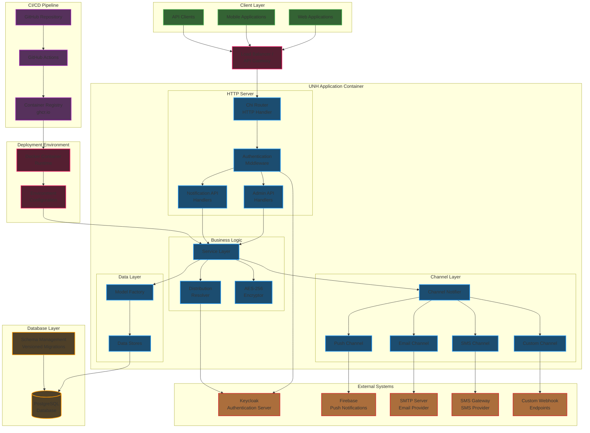

```mermaid
graph TB
    %% External Systems
    subgraph "External Systems"
        KC[Keycloak<br/>Authentication Server]
        FB[Firebase<br/>Push Notifications]
        SMTP[SMTP Server<br/>Email Provider]
        SMS[SMS Gateway<br/>SMS Provider]
        CUSTOM[Custom Webhook<br/>Endpoints]
    end

    %% Client Layer
    subgraph "Client Layer"
        WEB[Web Applications]
        MOBILE[Mobile Applications]
        API_CLIENT[API Clients]
    end

    %% Load Balancer / Gateway
    LB[Load Balancer /<br/>API Gateway]

    %% UNH Application
    subgraph "UNH Application Container"
        subgraph "HTTP Server"
            ROUTER[Chi Router<br/>HTTP Handler]
            AUTH[Authentication<br/>Middleware]
            ADMIN[Admin API<br/>Handlers]
            NOTIF[Notification API<br/>Handlers]
        end

        subgraph "Business Logic"
            SVC[Service Layer]
            RESOLVER[Distribution<br/>Resolver]
            ENCRYPTOR[AES-256<br/>Encryptor]
        end

        subgraph "Channel Layer"
            EMAIL_CH[Email Channel]
            PUSH_CH[Push Channel]
            SMS_CH[SMS Channel]
            CUSTOM_CH[Custom Channel]
            NOTIFIER[Channel Notifier]
        end

        subgraph "Data Layer"
            FACTORY[Model Factory]
            STORES[Data Stores]
        end
    end

    %% Database
    subgraph "Database Layer"
        PG[(PostgreSQL<br/>Database)]
        SCHEMA[Schema Management<br/>Versioned Migrations]
    end

    %% CI/CD Pipeline
    subgraph "CI/CD Pipeline"
        GH[GitHub Repository]
        GA[GitHub Actions]
        REG[Container Registry<br/>ghcr.io]
    end

    %% Deployment Environment
    subgraph "Deployment Environment"
        DOCKER[Docker Container<br/>Runtime]
        CONFIG[Environment<br/>Configuration]
    end

    %% Client connections
    WEB --> LB
    MOBILE --> LB
    API_CLIENT --> LB

    %% Load balancer to application
    LB --> ROUTER

    %% Internal application flow
    ROUTER --> AUTH
    AUTH --> ADMIN
    AUTH --> NOTIF
    ADMIN --> SVC
    NOTIF --> SVC

    %% Service layer connections
    SVC --> RESOLVER
    SVC --> ENCRYPTOR
    SVC --> NOTIFIER
    SVC --> FACTORY

    %% Channel connections
    NOTIFIER --> EMAIL_CH
    NOTIFIER --> PUSH_CH
    NOTIFIER --> SMS_CH
    NOTIFIER --> CUSTOM_CH

    %% External service connections
    EMAIL_CH --> SMTP
    PUSH_CH --> FB
    SMS_CH --> SMS
    CUSTOM_CH --> CUSTOM

    %% Authentication
    AUTH --> KC
    RESOLVER --> KC

    %% Data layer
    FACTORY --> STORES
    STORES --> PG
    SCHEMA --> PG

    %% CI/CD Flow
    GH --> GA
    GA --> REG
    REG --> DOCKER

    %% Deployment
    DOCKER --> CONFIG
    CONFIG --> SVC

    %% Styling
    classDef external fill:#ab6e3c,stroke:#d32f2f,stroke-width:2px
    classDef client fill:#346334,stroke:#4caf50,stroke-width:2px
    classDef app fill:#1c4d70,stroke:#2196f3,stroke-width:2px
    classDef data fill:#4f4028,stroke:#ff9800,stroke-width:2px
    classDef cicd fill:#56315c,stroke:#9c27b0,stroke-width:2px
    classDef deploy fill:#541f31,stroke:#e91e63,stroke-width:2px

    class KC,FB,SMTP,SMS,CUSTOM external
    class WEB,MOBILE,API_CLIENT client
    class ROUTER,AUTH,ADMIN,NOTIF,SVC,RESOLVER,ENCRYPTOR,EMAIL_CH,PUSH_CH,SMS_CH,CUSTOM_CH,NOTIFIER,FACTORY,STORES app
    class PG,SCHEMA data
    class GH,GA,REG cicd
    class DOCKER,CONFIG,LB deploy
```
