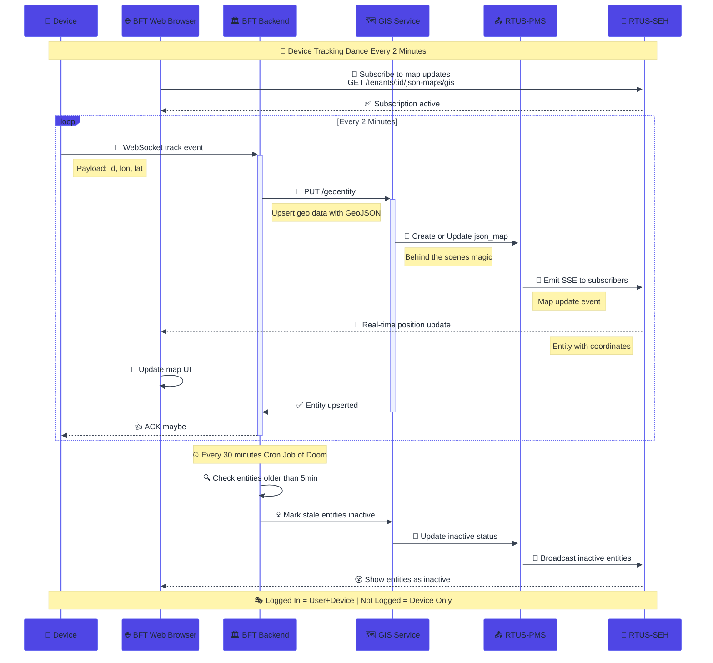

```mermaid
%%{init: {'theme':'base', 'themeVariables': { 'primaryColor': '#4F46E5', 'primaryTextColor': '#1F2937', 'primaryBorderColor': '#6366F1', 'lineColor': '#6366F1', 'signalColor': '#374151', 'signalTextColor': '#1F2937', 'activationBorderColor': '#6366F1', 'activationBkgColor': '#EEF2FF', 'loopTextColor': '#374151'}}}%%

sequenceDiagram
    participant D as 📱 Device
    participant B as 🌐 BFT Web Browser  
    participant BFT as 🏛️ BFT Backend
    participant G as 🗺️ GIS Service
    participant P as 📤 RTUS-PMS
    participant S as 🔔 RTUS-SEH
    
    Note over D,S: 🎯 Device Tracking Dance Every 2 Minutes
    
    %% Browser subscribes first
    B->>+S: 🔗 Subscribe to map updates<br/>GET /tenants/:id/json-maps/gis
    S-->>B: ✅ Subscription active
    
    %% Device tracking loop
    loop Every 2 Minutes
        D->>+BFT: 📡 WebSocket track event
        Note right of D: Payload: id, lon, lat
        
        BFT->>+G: 🎯 PUT /geoentity
        Note right of BFT: Upsert geo data with GeoJSON
        
        G->>+P: 🚀 Create or Update json_map
        Note right of G: Behind the scenes magic
        
        P->>+S: 📢 Emit SSE to subscribers
        Note right of P: Map update event
        
        S-->>B: 📍 Real-time position update
        Note left of S: Entity with coordinates
        
        B->>B: 🎨 Update map UI
        
        G-->>-BFT: ✅ Entity upserted
        BFT-->>-D: 👍 ACK maybe
    end
    
    Note over BFT: ⏰ Every 30 minutes Cron Job of Doom
    BFT->>BFT: 🔍 Check entities older than 5min
    BFT->>G: 💀 Mark stale entities inactive
    G->>P: 📢 Update inactive status  
    P->>S: 🔴 Broadcast inactive entities
    S-->>B: 😵 Show entities as inactive
    
    Note over D,S: 🎭 Logged In = User+Device | Not Logged = Device Only
```
